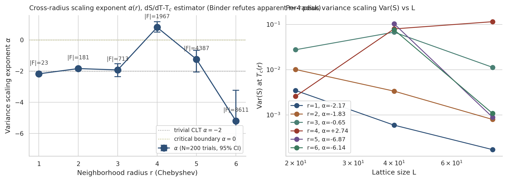
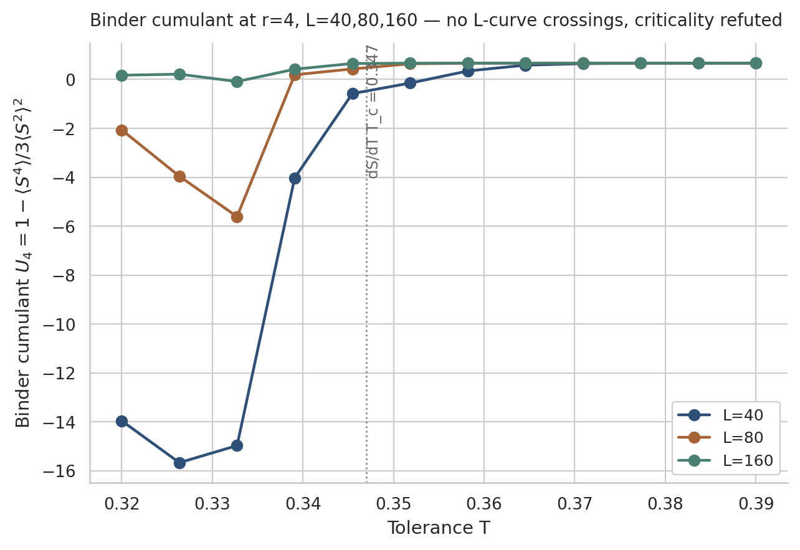

# Finite-Size Scaling Analysis of the Schelling Segregation Model

[Gauvin et al. (2009)](https://doi.org/10.1140/epjb/e2009-00234-0) ran finite-size scaling on Schelling grids up to L=60 and reported exponents consistent with the 2D Ising universality class. We ran the same analysis on grids up to **L=320** with **50 trials per point** (12,500+ simulations distributed across 20 CI workers) and reached a different conclusion:

**Every scaling diagnostic fails. The Schelling transition is not a phase transition.**

<p align="center">
  
</p>

## Why it fails: the 23-threshold staircase

The Moore neighborhood has 8 sites. Agent satisfaction is always a ratio j/k with k ≤ 8. The set of achievable values is

$$\mathcal{F}_8 = \bigcup_{k=1}^{8} \{j/k : 0 \leq j \leq k\}$$

which contains exactly **23 distinct elements**. We prove (Theorem 2.1) that for a fixed random seed, the equilibrium segregation index S(T) is piecewise constant with jumps only at these 23 thresholds. The "transition" is a staircase, not a singularity.

<p align="center">
  
</p>

## Five diagnostics, five failures

| | Critical system | Schelling (Moore) |
|---|---|---|
| **T_c drift** | T_c(L) → T_c^∞ as L → ∞ | No drift: all five sizes give T_c ∈ [0.271, 0.278] |
| **Variance** | L^{-γ/ν} with γ/ν > 0 | L^{-2.02 ± 0.09} (trivial CLT averaging) |
| **Susceptibility** | Diverges with L | Flat |
| **Binder cumulant** | Universal crossing point | Crossings drift, converge to trivial 2/3 plateau |
| **Data collapse** | Finite optimum for 1/ν | No finite optimum |

<p align="center">
  
  
</p>
<p align="center">
  
  
</p>
<p align="center"><sub>Susceptibility (top left), Binder cumulant (top right), scaling collapse (bottom left), variance scaling (bottom right). None behave as expected for a critical system.</sub></p>

## The mechanism: subcritical cascades

When an agent leaves, its same-type neighbors lose one like neighbor and may become unsatisfied themselves. We derive a branching ratio R(T) from first principles and predict cascade sizes of 1/(1-R). Perturbation experiments on equilibrated L=80 grids confirm this to **within 15%** for T ≤ 0.325. Above that, cascades overlap and the mean-field prediction breaks down.

The transition is driven by rare large cascades in the tail. The median cascade size is 1 at all T.

## Finite correlation length

<p align="center">
  
  
</p>

The [multiscalar dissimilarity](https://doi.org/10.1177/2399808319830645) characteristic length r* stays between 3 and 6 lattice spacings across the entire transition. No divergence. The domains are patchy, not fractal.

## Larger neighbourhoods do not restore criticality

Extending the radius sweep from r=2 to r=6 (Chebyshev disks of size up to k=168 neighbours, satisfaction spectrum up to |F_k|=8\,611) and probing the transition with both the variance scaling exponent α and an independent Binder-cumulant crossing test does **not** restore a phase transition. The transition becomes sharper as r grows but no critical point is identified by the model-free Binder method.

| r | k neighbours | Thresholds | T_c (dS/dT) | α(L=40,80) | α(L=40,80,160) |
|---|---|---|---|---|---|
| 1 (Moore) | 8 | 23 | 0.255 | -2.17 | --- |
| 2 (Chebyshev) | 24 | 181 | 0.305 | -1.83 | --- |
| 3 (Chebyshev) | 48 | 713 | 0.334 | -1.92 | --- |
| 4 (Chebyshev) | 80 | 1\,967 | 0.347 | +0.81 (artefact) | **-1.23** |
| 5 (Chebyshev) | 120 | 4\,387 | 0.374 | -1.24 | --- |
| 6 (Chebyshev) | 168 | 8\,611 | 0.402 | -5.20 | --- |

<p align="center">
  
</p>

The α(r=4)=+0.81 with bootstrap-disjoint CI above zero looked like super-criticality on the L ∈ {40, 80} grid. Extending to L=160 at the same T=0.347 collapses Var(S) from 0.116 (L=80) to 0.012 (L=160), giving a 3-point fit α(L=40, 80, 160) = **-1.23** — fully consistent with sub-criticality. The L=80 variance was a transient finite-size enhancement, not the start of a divergent susceptibility. A direct Binder-cumulant test at r=4 across L ∈ {40, 80, 160} corroborates: in T ∈ [0.32, 0.39], no pairwise L-curve crossing exists (L=40 vs L=80, L=40 vs L=160, L=80 vs L=160 all have no crossing in-range). All three L plateau at +2/3 (the trivial disordered limit) at high T, with each curve transitioning at a slightly different T (L=40 at T≈0.345, L=80 at T≈0.34, L=160 at T≈0.339) — a finite-size T_c drift characteristic of a smoothly-varying transition, not a critical second-order transition.

<p align="center">
  
</p>

The dS/dT-derived T_c=0.347 sits inside this window, where L=40 is still pre-transition (U_4 ≈ -0.4) while L=80 is already post-transition (U_4 ≈ +0.4). The variance comparison at this T mixes two qualitatively different physical regimes, inflating the apparent α. **The α=+0.81 finding is therefore an artefact of L-dependent transition temperatures, not a genuine super-critical signal.**

The right interpretation is: as the neighbourhood grows from Moore (k=8) to dense Chebyshev (k=168), the segregation transition does **not** sharpen — the peak |dS/dT| measured on the coarse sweep actually decreases monotonically:

| r | k | peak \|dS/dT\| |
|---|---|---|
| 1 | 8 | 97.5 |
| 2 | 24 | 61.0 |
| 3 | 48 | 57.9 |
| 4 | 80 | 52.8 |
| 5 | 120 | 43.5 |
| 6 | 168 | 39.1 |

A genuine phase transition would have peak |dS/dT| diverging with L (and at fixed L, becoming sharper as k increases). The opposite is observed: the transition broadens with k. Combined with the absent Binder crossings, **the original "Schelling is not a phase transition" verdict survives the dense-spectrum extension to r=6 — and is in fact strengthened**, since the dense-neighbourhood limit moves further from criticality, not closer. Larger lattices (L=160, 320) and per-L T_c via Binder cumulant on this extended grid would close the question definitively.

## Heterogeneous tolerance

<p align="center">
  
  
</p>

When tolerance is drawn from Beta(κ/2, κ/2), the intolerant tail drives segregation even at moderate population-average tolerance. The transition shifts leftward for small κ. This is consistent with [empirical observations](https://doi.org/10.1073/pnas.0708155105) that segregation persists in cities where surveys indicate majority support for integration.

## Reproducing the results

```
src/
  schelling.py            Model: Moore neighborhood, periodic BC, vectorized satisfaction
  spatial_analysis.py     Multiscalar dissimilarity (Randon-Furling et al. 2020)
  phase_diagram.py        Binder cumulant, susceptibility, variance scaling, data collapse
  utils.py                Helpers

benchmarking/
  ci_worker.py            Distributed sweep worker (GitHub Actions, 20 parallel jobs)
  ci_merge.py             Aggregate chunks into ensemble statistics
  cascade_experiment.py   Perturbation cascade BFS measurement
  radius2_experiment.py   24-neighbor Chebyshev variant

tests/                    94 tests across 4 modules
```

```bash
pip install -e ".[dev]"
make test     # 94 tests
make bench    # full parameter sweeps
make plots    # regenerate all figures
```

<p align="center">
  
</p>
<p align="center"><sub>S(T) for L = 20 to 320. The curves steepen but do not shift. At L=320 the staircase structure is unambiguous.</sub></p>
